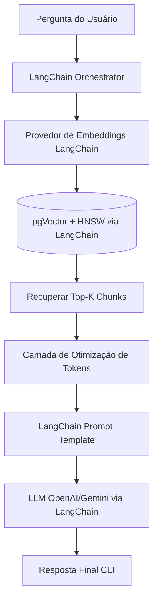

# Semantic PDF RAG CLI

> Aplicativo CLI em Python com Clean Architecture para Geração Aumentada de Recuperação (RAG) de documentos PDF, focado em alta performance e conscientização de custos (tokens).

O **Semantic PDF RAG CLI** foi construído como um sistema de nível profissional para portfólio, demonstrando práticas modernas de arquitetura de IA e desenvolvimento Python.

---

## O Desafio

O projeto foi criado para cumprir o seguinte requisito técnico:
> *"Desenvolver um software em Python capaz de ler um PDF, armazenar os dados vetorizados em um banco PostgreSQL com pgVector e permitir buscas semânticas por meio de um chat via terminal (CLI) utilizando LangChain, embeddings e modelos LLM (OpenAI ou Gemini)."*

---

## Principais Princípios Arquiteturais

- **Arquitetura Limpa & Ports/Adapters**: Lógica de domínio (Core) isolada da infraestrutura.
- **Integração com LangChain**: Utilização profunda do ecossistema LangChain para orquestração de RAG, modelos de embeddings e comunicação com LLMs.
- **Chunking com LangChain**: Estratégia de divisão de texto padronizada via Text Splitters (ex.: `RecursiveCharacterTextSplitter`) mantendo configuração 1000/200.
- **Governança Explícita de Tokens**: Inclui uma Camada de Estratégia de Otimização de Tokens para aplicar controle de orçamento de contexto.
- **Focado em CLI**: Projetado para processamento de alta velocidade baseado no terminal.
- **Pronto para Produção**: Testável, extensível, e estruturado com tipagem (Type Hints) e logs claros.

---

## Estrutura do Projeto

O projeto segue uma regra de Dependência Adaptada, focando em manutenibilidade e escalabilidade:

```text
semantic-pdf-rag/
├── cli/                 # Camada de apresentação CLI baseada no Typer
├── core/                # Orquestração RAG usando LangChain e Casos de Uso
├── domain/              # Lógica de negócio pura (Entidades, Interfaces)
├── infra/               # Implementações de armazenamento e integrações de LLM
└── tests/               # Testes Unitários e de Integração
```

---

## Fluxo de Execução (RAG Flow)



### Governança e Estratégia de Tokens
Antes de cada chamada ao LLM, o sistema garante eficiência de tokens através de:
1. Ajuste dinâmico de recuperação (Top-K) e filtragem por limite de similaridade.
2. Compressão da janela de contexto e remoção de redundância.
3. Reserva de tokens para a saída e aplicação rígida de limites máximos (Context window limits).

---

## Stack Tecnológico

- **Linguagem**: Python 3.11+
- **Framework de IA**: LangChain (Mandatório)
- **Chunking**: LangChain Text Splitters (`RecursiveCharacterTextSplitter`)
- **Banco de Dados**: PostgreSQL com extensão `pgVector`
- **Modelos**: OpenAI ou Google Gemini (Embeddings e LLM)
- **CLI**: Typer
- **Validação**: Pydantic
- **Testes**: Pytest
- **Infraestrutura**: Docker & Docker Compose

---

## Guia de Início Rápido (Planejado)

```bash
# Inserir um documento PDF no banco de vetores
semantic-rag ingest caminho/para/o/arquivo.pdf

# Iniciar uma sessão de chat usando os documentos indexados
semantic-rag chat

# Visualizar estatísticas de indexação
semantic-rag stats
```

---

## Objetivos do Projeto

- **Demonstrar conhecimento aplicado em arquitetura de IA** utilizando padrões de Arquitetura Limpa em um contexto de LLMs.
- **Apresentar um design escalável para RAG** usando PostgreSQL e pgVector para recuperação a nível empresarial.
- **Exibir conscientização de custos** através de rigoroso controle de tokens e isolamento de orçamentos.
- **Fornecer um sistema pronto para portfólio** expondo práticas robustas de engenharia de software corporativa.

---

## 📝 Licença

Este projeto está sob a Licença MIT - veja o arquivo [LICENSE](LICENSE) para mais detalhes.